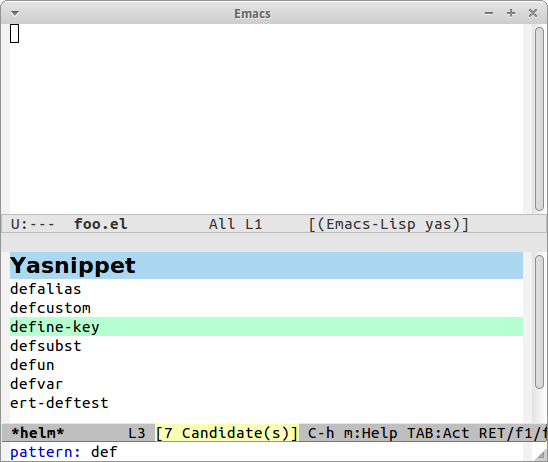

# helm-c-yasnippet
helm source for yasnippet.el

## Screenshot




## Installation

`helm-c-yasnippet` is available on [MELPA][melpa] and [MELPA-STABLE][melpa-stable].

You can install `helm-c-yasnippet` with the following command.

<kbd>M-x package-install [RET] helm-c-yasnippet [RET]</kbd>


## Sample Configuration

```lisp
(require 'yasnippet)
(require 'helm-c-yasnippet)
(setq helm-yas-space-match-any-greedy t)
(global-set-key (kbd "C-c y") 'helm-yas-complete)
(yas-global-mode 1)
(yas-load-directory "<path>/<to>/snippets/")
```
